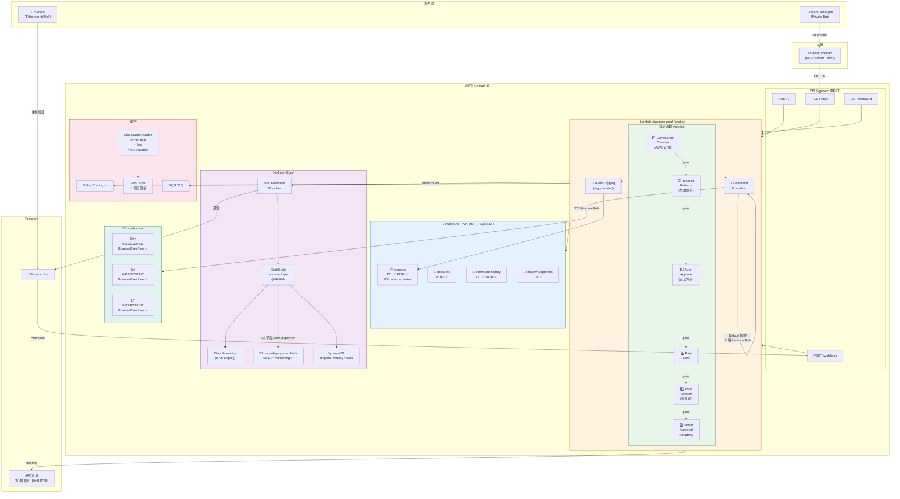
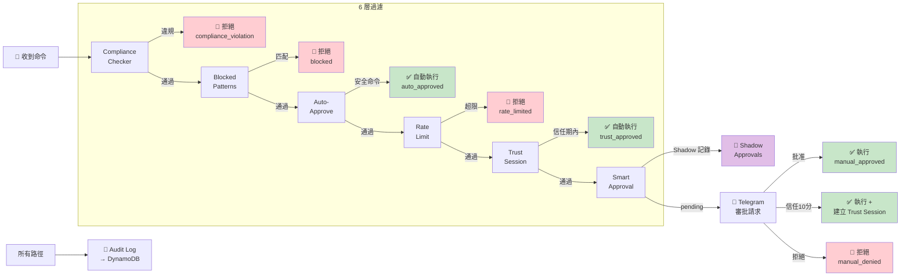
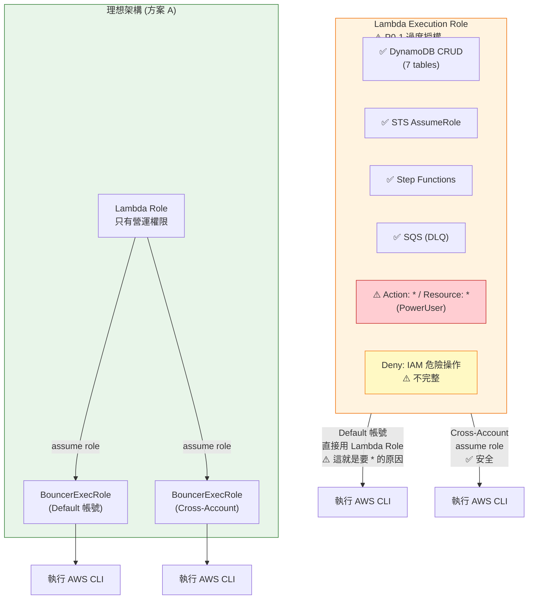
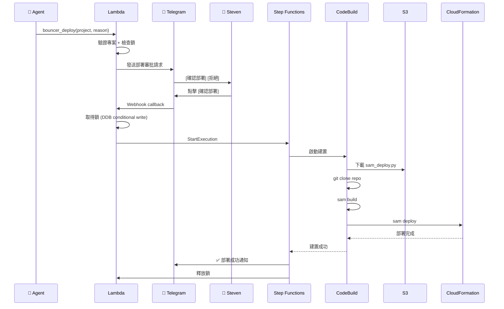
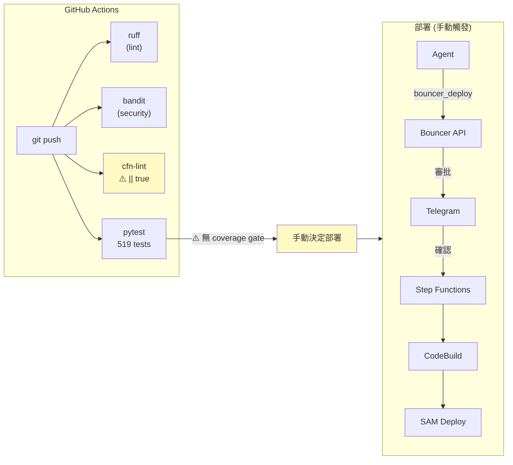

# Bouncer v3.0.0 — Architecture Diagram (Mermaid)

## 整體架構

```mermaid
graph TB
    subgraph Clients["客戶端"]
        Agent["🤖 OpenClaw Agent<br/>(Private Bot)"]
        Steven["👤 Steven<br/>(Telegram 審批者)"]
    end

    subgraph LocalMCP["本機"]
        MCP["bouncer_mcp.py<br/>(MCP Server / stdio)"]
    end

    subgraph AWS["AWS (us-east-1)"]
        subgraph APIGW["API Gateway (REST)"]
            EP_MCP["POST /mcp"]
            EP_WH["POST /webhook"]
            EP_REST["POST /"]
            EP_STATUS["GET /status/:id"]
        end

        subgraph Lambda["Lambda: bouncer-prod-function<br/>Python 3.9 | ARM64 | 256MB | 900s"]
            subgraph Pipeline["請求處理 Pipeline"]
                Compliance["1️⃣ Compliance<br/>Checker<br/>(AWS 安規)"]
                Blocked["2️⃣ Blocked<br/>Patterns<br/>(危險命令)"]
                AutoApprove["3️⃣ Auto-<br/>Approve<br/>(安全命令)"]
                RateLimit["4️⃣ Rate<br/>Limit"]
                Trust["5️⃣ Trust<br/>Session<br/>(信任期)"]
                SmartApproval["6️⃣ Smart<br/>Approval<br/>(Shadow)"]
            end
            AuditLog["📝 Audit Logging<br/>(log_decision)"]
            CmdExec["⚡ Command<br/>Execution"]
        end

        subgraph DDB["DynamoDB (PAY_PER_REQUEST)"]
            Requests["📋 requests<br/>TTL ✅ PITR ✅<br/>GSI: source, status"]
            Accounts["👥 accounts<br/>PITR ✅"]
            CmdHist["📜 command-history<br/>TTL ✅ PITR ✅"]
            Shadow["🔮 shadow-approvals<br/>TTL ✅"]
        end

        subgraph Deployer["Deployer Stack"]
            SFn["Step Functions<br/>Workflow"]
            CB["CodeBuild<br/>sam-deployer<br/>(ARM64)"]
            CFN["CloudFormation<br/>(SAM Deploy)"]
            S3["S3: sam-deployer-artifacts<br/>KMS ✅ Versioning ✅"]
            DeployDDB["DynamoDB:<br/>projects / history / locks"]
        end

        subgraph Monitoring["監控"]
            Alarms["CloudWatch Alarms<br/>• Error Rate<br/>• 5xx<br/>• p99 Duration"]
            XRay["X-Ray Tracing ✅"]
            SNS["SNS Topic<br/>⚠️ 無訂閱者"]
            DLQ["SQS DLQ"]
        end

        subgraph CrossAccount["Cross-Account"]
            Dev["Dev<br/>992382394211<br/>BouncerExecRole ✅"]
            First["1st<br/>841882238387<br/>BouncerExecRole ✅"]
            LT["LT<br/>811246247192<br/>BouncerExecRole ✅"]
        end
    end

    subgraph TG["Telegram"]
        TGBot["🤖 Bouncer Bot"]
        TGMsg["審批訊息<br/>[批准] [信任10分] [拒絕]"]
    end

    Agent -->|MCP stdio| MCP
    MCP -->|HTTPS| EP_MCP
    Steven -->|操作按鈕| TGBot
    TGBot -->|Webhook| EP_WH
    EP_REST --> Lambda
    EP_MCP --> Lambda
    EP_WH --> Lambda
    EP_STATUS --> Lambda

    Compliance -->|pass| Blocked
    Blocked -->|pass| AutoApprove
    AutoApprove -->|pass| RateLimit
    RateLimit -->|pass| Trust
    Trust -->|pass| SmartApproval
    SmartApproval -->|pending| TGMsg

    Lambda --> AuditLog
    AuditLog --> Requests
    Lambda --> CmdExec

    CmdExec -->|"Default 帳號<br/>⚠️ 用 Lambda Role"| CmdExec
    CmdExec -->|"STS AssumeRole"| CrossAccount

    Lambda --> DDB
    Lambda -->|states:Start| SFn

    SFn --> CB
    CB -->|"S3 下載 sam_deploy.py"| S3
    CB --> CFN
    SFn -->|通知| TGBot
    CB --> DeployDDB

    Alarms --> SNS
    Lambda --> DLQ
    Lambda --> XRay

    style Pipeline fill:#e8f5e9,stroke:#2e7d32
    style Lambda fill:#fff3e0,stroke:#ef6c00
    style DDB fill:#e3f2fd,stroke:#1565c0
    style Deployer fill:#f3e5f5,stroke:#7b1fa2
    style CrossAccount fill:#e0f2f1,stroke:#00695c
    style Monitoring fill:#fce4ec,stroke:#c62828
```

## 請求處理 Pipeline 詳細

```mermaid
flowchart LR
    REQ["📨 收到命令"] --> C1

    subgraph Pipeline["6 層過濾"]
        C1["Compliance<br/>Checker"] -->|違規| R1["🚫 拒絕<br/>compliance_violation"]
        C1 -->|通過| C2["Blocked<br/>Patterns"]
        C2 -->|匹配| R2["🚫 拒絕<br/>blocked"]
        C2 -->|通過| C3["Auto-<br/>Approve"]
        C3 -->|安全命令| R3["✅ 自動執行<br/>auto_approved"]
        C3 -->|通過| C4["Rate<br/>Limit"]
        C4 -->|超限| R4["🚫 拒絕<br/>rate_limited"]
        C4 -->|通過| C5["Trust<br/>Session"]
        C5 -->|信任期內| R5["✅ 自動執行<br/>trust_approved"]
        C5 -->|通過| C6["Smart<br/>Approval"]
    end

    C6 -->|"Shadow 記錄"| SHADOW["🔮 Shadow<br/>Approvals"]
    C6 -->|pending| TG["📱 Telegram<br/>審批請求"]

    TG -->|批准| EXEC["✅ 執行<br/>manual_approved"]
    TG -->|信任10分| TRUST["✅ 執行 +<br/>建立 Trust Session"]
    TG -->|拒絕| DENY["🚫 拒絕<br/>manual_denied"]

    ALL_RESULTS["所有路徑"] --> AUDIT["📝 Audit Log<br/>→ DynamoDB"]

    style R1 fill:#ffcdd2
    style R2 fill:#ffcdd2
    style R3 fill:#c8e6c9
    style R4 fill:#ffcdd2
    style R5 fill:#c8e6c9
    style EXEC fill:#c8e6c9
    style TRUST fill:#c8e6c9
    style DENY fill:#ffcdd2
    style SHADOW fill:#e1bee7
```

## IAM 權限結構

```mermaid
graph TB
    subgraph LambdaRole["Lambda Execution Role<br/>⚠️ P0-1 過度授權"]
        P1["✅ DynamoDB CRUD<br/>(7 tables)"]
        P2["✅ STS AssumeRole"]
        P3["✅ Step Functions"]
        P4["✅ SQS (DLQ)"]
        P5["⚠️ Action: * / Resource: *<br/>(PowerUser)"]
        P6["Deny: IAM 危險操作<br/>⚠️ 不完整"]
    end

    subgraph Ideal["理想架構 (方案 A)"]
        IR1["Lambda Role<br/>只有營運權限"]
        IR2["BouncerExecRole<br/>(Default 帳號)"]
        IR3["BouncerExecRole<br/>(Cross-Account)"]
    end

    LambdaRole -->|"Default 帳號<br/>直接用 Lambda Role<br/>⚠️ 這就是要 * 的原因"| DefaultExec["執行 AWS CLI"]
    LambdaRole -->|"Cross-Account<br/>assume role<br/>✅ 安全"| CrossExec["執行 AWS CLI"]

    IR1 -->|"assume role"| IR2
    IR1 -->|"assume role"| IR3
    IR2 --> DefaultExec2["執行 AWS CLI"]
    IR3 --> CrossExec2["執行 AWS CLI"]

    style P5 fill:#ffcdd2,stroke:#c62828
    style P6 fill:#fff9c4,stroke:#f57f17
    style Ideal fill:#e8f5e9,stroke:#2e7d32
    style LambdaRole fill:#fff3e0,stroke:#ef6c00
```

## Deployer 部署流程

```mermaid
sequenceDiagram
    participant Agent as 🤖 Agent
    participant Bouncer as Lambda
    participant TG as 📱 Telegram
    participant Steven as 👤 Steven
    participant SFn as Step Functions
    participant CB as CodeBuild
    participant S3 as S3
    participant CFN as CloudFormation

    Agent->>Bouncer: bouncer_deploy(project, reason)
    Bouncer->>Bouncer: 驗證專案 + 檢查鎖
    Bouncer->>TG: 發送部署審批請求
    TG->>Steven: [確認部署] [拒絕]
    Steven->>TG: 點擊 [確認部署]
    TG->>Bouncer: Webhook callback
    Bouncer->>Bouncer: 取得鎖 (DDB conditional write)
    Bouncer->>SFn: StartExecution
    SFn->>CB: 啟動建置
    CB->>S3: 下載 sam_deploy.py
    CB->>CB: git clone repo
    CB->>CB: sam build
    CB->>CFN: sam deploy
    CFN-->>CB: 部署完成
    CB-->>SFn: 建置成功
    SFn->>TG: ✅ 部署成功通知
    SFn->>Bouncer: 釋放鎖
```

## CI/CD Pipeline

```mermaid
graph LR
    subgraph GH["GitHub Actions"]
        Push["git push"] --> Lint["ruff<br/>(lint)"]
        Push --> Security["bandit<br/>(security)"]
        Push --> CFNLint["cfn-lint<br/>⚠️ || true"]
        Push --> Test["pytest<br/>519 tests"]
    end

    subgraph Deploy["部署 (手動觸發)"]
        Agent2["Agent"] -->|bouncer_deploy| Bouncer2["Bouncer API"]
        Bouncer2 -->|審批| TG2["Telegram"]
        TG2 -->|確認| SFn2["Step Functions"]
        SFn2 --> CB2["CodeBuild"]
        CB2 --> CFN2["SAM Deploy"]
    end

    Test -->|"⚠️ 無 coverage gate"| Manual["手動決定部署"]
    Manual --> Deploy

    style CFNLint fill:#fff9c4
    style Manual fill:#fff9c4
```
